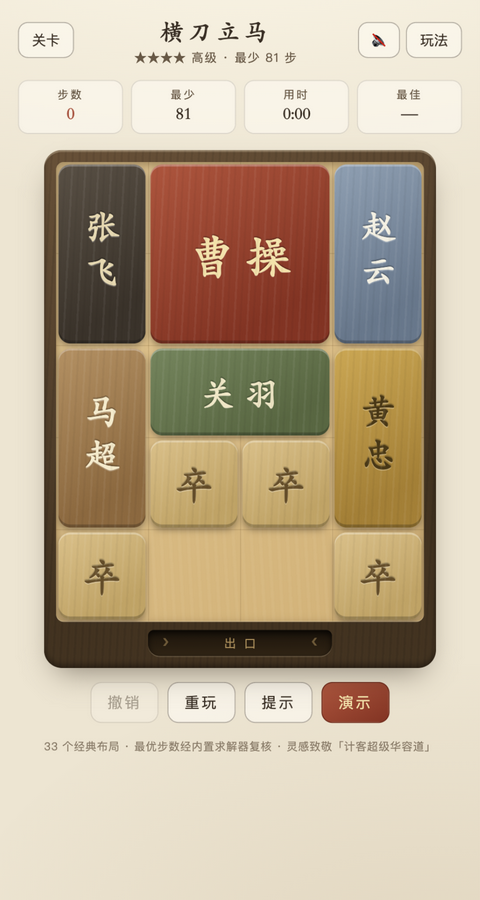

# 华容道 · 网页游戏

一个纯前端的经典华容道（Klotski）滑块益智游戏，无需构建、无外部依赖，直接用浏览器打开即玩。



## 怎么玩

```bash
# 方式一：直接双击打开 index.html（file:// 也可运行）
# 方式二：起个静态服务器
cd Klotski && python3 -m http.server 8734
# 打开 http://localhost:8734/
```

把 **曹操** 滑到棋盘底部中央的**出口**即通关。棋子只能沿水平/垂直方向滑动，不能跨越其他棋子。

## 特性

- **33 个经典名局**，按难度分 5 档（入门 → 大师），从「前呼后拥」22 步到「峰回路转」138 步，横刀立马、指挥若定、层层设防等著名布局悉数收录。
- **内置求解器**：0-1 BFS（Dial 桶队列）最优解搜索。
  - 「提示」实时推演当前局面的最优下一步，虚线幽灵标记落点；
  - 「演示」自动播放完整解法。
- **经典计步**：同一棋子连续滑动（含拐弯）算 1 步，与华容道社区公认计步一致——「横刀立马」最少 81 步。每关展示理论最少步数。
- **成绩记录**：每关最佳步数/用时存于 localStorage（URL `?lvl=关卡id` 可直达；使用提示或演示通关不计入纪录）。
- **操作方式**：拖拽滑动（限制在合法行程内）；轻点棋子——只有一个方向可走时直接走，多方向时弹出方向箭头，完全被堵时晃动提示；**完整键盘支持**：`Tab`/`Shift+Tab` 循环选子（只含走得动的棋子，优先定位刚动过的），`↑↓←→` 移动，`Z` 撤销、`H` 提示、`D` 演示、`L` 关卡、`M` 音效、`I` 说明、`R`×2 重玩，通关后 `Enter` 下一关，可全程脱鼠游玩。
- **细节**：开局棋子飞入摆放动画、曹操滑出出口的通关动画、WebAudio 合成音效（无音频资源）、移动端触控适配、布局数据来源与最优步数均已复核。

## 目录结构

```
Klotski/
├── index.html          # 入口页面
├── css/style.css       # 木质传统风格样式
├── js/
│   ├── levels.js       # 33 关布局数据（tools/gen-levels.js 生成）
│   ├── solver.js       # 0-1 BFS 最优解求解器
│   ├── audio.js        # WebAudio 合成音效
│   └── game.js         # 游戏主逻辑
└── tools/              # 开发工具（不参与运行）
    ├── fayaa.js                    # 原始布局数据（fayaa.com 合集，经 SimonHung/Klotski 整理）
    ├── parse.js                    # 解析 + 全量步数验证脚本
    ├── verify-results.json         # 407 个中文命名布局的验证结果
    └── gen-levels.js               # 生成 js/levels.js
```

## 求解器与数据验证

计步规则是华容道的关键细节：**同一棋子的一次连续移动（可以中途拐弯）记为 1 步**。求解器据此建模为 0-1 BFS——滑动同一棋子代价 0、更换棋子代价 1，用 Dial 桶队列按代价递增扩展，状态键做同形棋子置换归一化。

用该求解器对数据源中全部 **351 个标准棋子构成的布局**逐一求解，最优步数与公认值**完全一致**（横刀立马 81、指挥若定 70、层层设防二 120……），著名无解局「走投无路」也被正确判定无解。游戏内置的 33 关全部通过同一验证（见 `tools/verify-results.json`）。

## 致谢

- 布局数据：[fayaa.com 华容道合集](http://fayaa.com/youxi/hrd/)（经 [SimonHung/Klotski](https://github.com/SimonHung/Klotski) 整理），经典布局本身属公共领域。
- 背景：[华容道（游戏）- 维基百科](https://zh.wikipedia.org/wiki/華容道_(遊戲))，横刀立马 81 步最优解由马丁·加德纳于 1964 年刊出。
